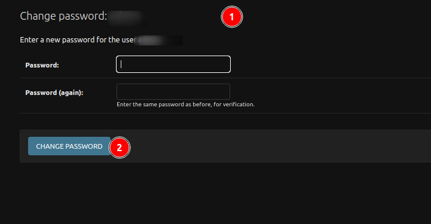
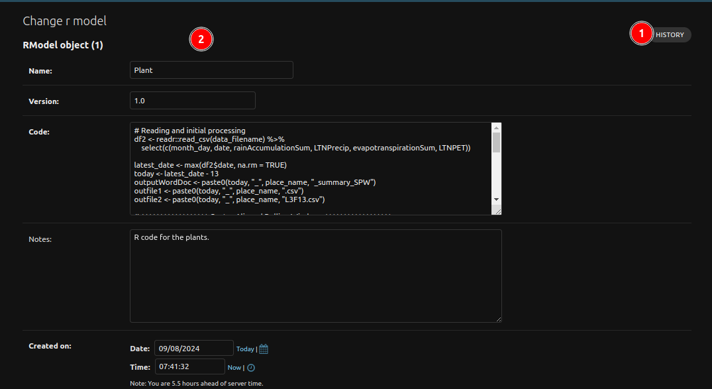
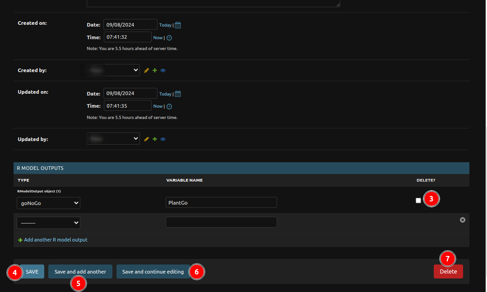
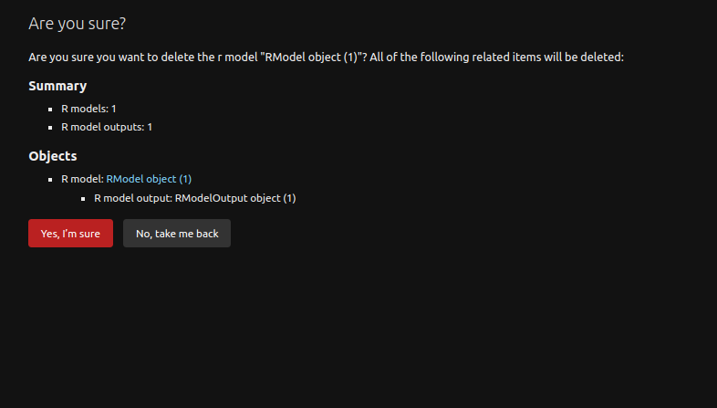

# Change Record

## Change User

1. **History**: Button to view actions applied to the current record.

2. **Change Password**: The administrators can change the user's password by clicking on `this form` link. A popup will open to change the user's password.

    - 

    1. **Change Password Form**: Form to change the user's password.

    2. **Change Password Button**: The administrators can change the user's password by clicking on the `CHANGE PASSWORD` button.

3. **Personal Information:** The administrators can add/update the personal information of the user.

### Change User Permission

1.  **Checkbox**: The administrators can grant permissions to a user by checking the checkbox.

2.  **Arrows**: The administrators can assign or unassign a group to the user by selecting and using these arrows.

3. **Choose All**: The administrators can assign all available groups to the user.

4. **Remove All**: The administrators can unassign all groups from the user.

5. **Permissions**: The administrators can assign or unassign permissions to the user using this table.

6. **Search Permissions**: The administrators can search for permissions using the search functionality.

### Change Dates And User Info

1. **Dates**: The administrators can edit the last login date-time and date joined date-time of a user from this section.

2. **Save**: Save the current record, then redirect to the Django Admin Table/record list.

3. **Save and add another**: Save the current record, then redirect to a new page to add a new record.

4. **Save and continue editing**: Save the current record while still showing the current record.

5. **Delete**: The administrators can delete the user by clicking on this button. The popup will open for the confirmation to delete the user.

## Change R Model

1. **History**: Button to view actions applied to the current record.

2. **Form Fields**: Researchers have the ability to update the values of various fields within the R Model form. The following fields are available for editing:

- Name
- Version
- Code
- Notes

- Created On: The date and time the R Model was created. Researchers can select the date from the calendar or set it to the current date by clicking on the `Today` button. The time can be set by clicking on the clock icon or set to the current time by clicking on the `Now` button.

- Created By: A dropdown menu listing the available researchers who can create R Models.

- Updated On: The date and time the R Model was last updated. Researchers can select the date from the calendar or set it to the current date by clicking on the `Today` button. The time can be set by clicking on the clock icon or set to the current time by clicking on the `Now` button.

- Updated By: A dropdown menu listing the available researchers who can update R Models.

3. **Delete Checkbox**: Check mark the checkbox to delete the associated r model outputs.

4. **Save**: This option saves the current r model record and redirects administrators to the Django Admin Table/record list.

5. **Save and Add Another**: This option saves the current rmodel record and redirects administrators to a new page to add another r model record.

6. **Save and Continue Editing**: Choosing this option saves the current r model record while still displaying the current record for further editing.

7. **Delete**: The administrator can delete the r model by clicking on the `Delete` button. It will ask for confirmation to delete the r model object.

    
