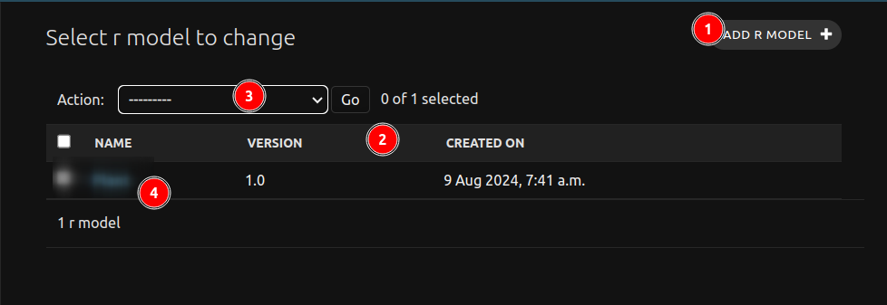
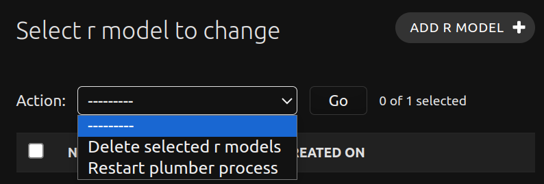
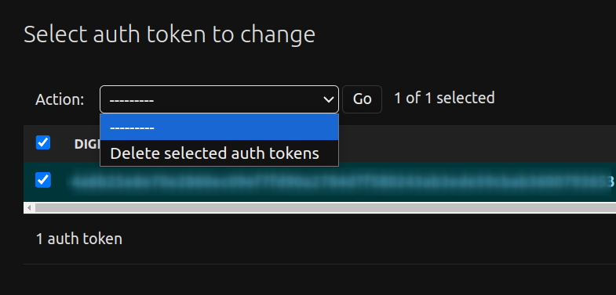

# Django Tables

## User Table

The user table within the Django Admin interface allows administrators to manage user-related tasks efficiently.

1. **Add User**: Clicking on the `ADD USER` button allows administrators to add a new user. Click on [add user](django-add-record.md) to see detailed documentation on adding a new user.

2. **Filter**: Available filters to filter the records of the user table.

    - 

    1. **Clear All Filters**: Clicking on the `clear all filters` allows administrators to clear all the filters.

    2. **Filter Field**: The names of the filter field and attributes for filtering the records.

3. **Search Functionality**: The administrators can search the records using the search functionality.

4. **User Table**: The user table with records.

5. **Edit User**: Clicking on the object allows the administrators to change or edit a particular record. Click [here](django-change-record.md) to view detailed documentation on editing a user.

## R Model Table

The R Model table within the GAP Admin interface allows researchers to manage and track different versions of the R code used to produce plant/no plant signals.

1. **Add R Model:** Clicking on the `ADD R MODEL` button allows researchers to add a new version of the R code. Click [here](django-add-record.md) to see detailed documentation on adding a new R model.

2. **R Model Table:** The R Model table with records, displaying information such as the version number, description, and date added.

3. **Action Dropdown:** The Action dropdown of the R Model table and allows researchers to perform various actions on the records. To access the Action Dropdown, click on the dropdown.

    

    **Performing Actions:** To perform an action on a record, follow these steps:

    - Select Records: Check the box available in front of the records to perform the action on.

    - Choose Action: Select the desired action from the dropdown menu.

    - Go Button: Click on the Go button to execute the chosen action.

    The available actions include:

    - Delete selected r model: Permanently remove the selected record(s) from the R Model table.

    - Restart plumber process: Restarts the plumber process.

4. **Edit R Model:** Clicking on the object allows researchers to change or edit a particular version of the R code. Click [here](django-change-record.md) to view detailed documentation on editing an R model.

## Auth Model Table

1. **Add Auth Token:** Clicking on the 1️⃣ `ADD Auth Token` button allows researchers to add a new token to auth model. Click [here](django-add-record.md) to see detailed documentation on adding a new Auth Token.

2. **Auth Model Table:** The Auth Model table with records, displaying information such as the Digest, User, Created date and Expiry date.

3. **Action Dropdown:** The Action dropdown of the Auth model table allows user to perform various actions on the records. To access the Action Dropdown, click on the dropdown.

    

    **Perform Action:** To perform an action on a record, follow these steps :
    
    - Select Records: Check the box available in front of the records to perform the action on.

    - Choose Action: Select the desired action from the dropdown menu.

    - Go Button: Click on the Go button to execute the chosen action.

    The available actions include:

    - Delete selected auth tokens: Permanently remove the selected record(s) from the Auth Model table.

4. **Edit Auth Model:** Clicking on the object allows user to modify or edit a specific Auth Model table record. Click [here](django-change-record.md) to view detailed documentation on editing an Auth Model.