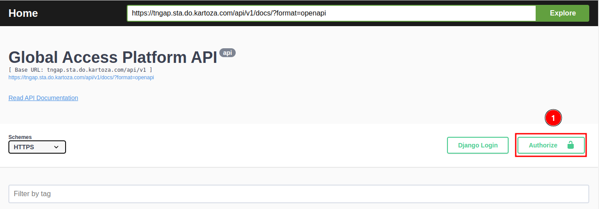
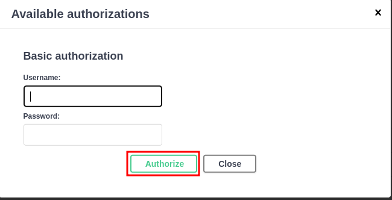
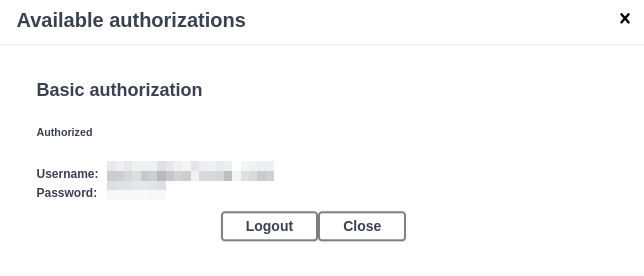

# OSIRIS II Global Access Platform

**Project Overview**

TomorrowNow.org is partnering with the Bill and Melinda Gates Foundation (BMGF) to develop and assess new weather technologies to support the seed breeding ecosystem in East Africa. The "Next-Gen" project focuses on adopting new or next-generation technologies to improve data access and quality.

**Goals**

The project aims to address two key challenges limiting the uptake of weather data in Africa:

1. **Data Access**: Provide curated datasets from top weather data providers, streamlined APIs, and a global access strategy to ensure long-term, low-cost access to weather data.

2. **Data Quality**: Localise forecast models using a network of ground observation stations, apply bias adjustment techniques, and produce analysis-ready datasets using best-practice quality control methods.

**Objectives**

* Improve data quality by measuring and benchmarking data quality and cost across top models for historical climate reanalysis, short-term weather forecasting, and S2S weather forecasting.

* Enhance data access through a global access strategy and partnerships with data providers.

**Impact**

By addressing data access and quality challenges, the project aims to accelerate the adoption of weather intelligence across the smallholder farming ecosystem in East Africa.

TomorrowNow provides access to the data through a RESTful API, available at https://tngap.sta.do.kartoza.com/api/v1/docs/

## GAP Input Data Table

| Product | Provider | Resolution | Source | Version | API product_type |
|---------|----------|------------|--------|---------|------------------|
| **Historical Data** |
| Climate Reanalysis | Tomorrow.io | 4km² | Tomorrow.io CBAM 1F enhanced bias-corrected reanalysis | 2012-2023 | historical_reanalysis |
| Tahmo Ground Observation Data | TAHMO weather stations | 300+ stations across East Africa | TAHMO Gap Filled Data (csv) | 2018-2024 | tahmo_ground_observation |
| Arable Ground Observation Data | Arable weather stations | 300+ stations across East Africa | Arable (API) | | arable_ground_observation |
| Tahmo Disdrometer Observation Data | Tahmo disdrometers | | Tahmo (API) | | tahmo_disdrometer_observation |
| **Weather Forecasts** |
| Short-term Deterministic Weather Forecast | Tomorrow.io | 4km² | Tomorrow.io CBAM satellite enhanced short-term weather forecasts | | shortterm_forecast |
| Seasonal Probabilistic Weather Forecast | Salient | 9km² | Salient (API) | v9 | seasonal_forecast |
| |

## Attributes Table

| Product | Name | Description | Unit | API attribute name |
|---------|------|-------------|------|---------------------|
| **Seasonal Forecast** |
| Seasonal Forecast | Temperature | | °C | temperature |
| Seasonal Forecast | Temperature Climatology | | °C | temperature_clim |
| Seasonal Forecast | Temperature Anomaly | | °C | temperature_anom |
| Seasonal Forecast | Precipitation | | mm day-1 | precipitation |
| Seasonal Forecast | Precipitation Anomaly | | mm day-1 | precipitation_anom |
| Seasonal Forecast | Precipitation Climatology | | mm day-1 | precipitation_clim |
| Seasonal Forecast | Minimum Temperature | | °C | min_temperature |
| Seasonal Forecast | Minimum Temperature Climatology | | °C | min_temperature_clim |
| Seasonal Forecast | Minimum Temperature Anomaly | | °C | min_temperature_anom |
| Seasonal Forecast | Maximum Temperature | | °C | max_temperature |
| Seasonal Forecast | Maximum Temperature Climatology | | °C | max_temperature_clim |
| Seasonal Forecast | Maximum Temperature Anomaly | | °C | max_temperature_anom |
| Seasonal Forecast | Relative Humidity | | % | relative_humidty |
| Seasonal Forecast | Relative Humidity Climatology | | % | relative_humidty_clim |
| Seasonal Forecast | Relative Humidity Anomaly | | % | relative_humidty_anom |
| Seasonal Forecast | Downward Solar Radiation | | kWh m-2 day-1 | solar_radiation |
| Seasonal Forecast | Downward Solar Radiation Climatology | | kWh m-2 day-1 | solar_radiation_clim |
| Seasonal Forecast | Downward Solar Radiation Anomaly | | kWh m-2 day-1 | solar_radiation_anom |
| Seasonal Forecast | Wind Speed Climatology | | m/s | wind_speed |
| Seasonal Forecast | Wind Speed Climatology | | m/s | wind_speed_clim |
| Seasonal Forecast | Wind Speed Climatology | | m/s | wind_speed_anom |
| **Short-term Forecast** |
| Short-term Forecast | Total Rainfall | | mm | total_rainfall |
| Short-term Forecast | Total Evapotranspiration Flux | | mm | total_evapotranspiration_flux |
| Short-term Forecast | Max Temperature | | °C | max_temperature |
| Short-term Forecast | Min Temperature | | °C | min_temperature |
| Short-term Forecast | Precipitation Probability | | % | precipitation_probability |
| Short-term Forecast | Humidity Maximum | | % | humidity_maximum |
| Short-term Forecast | Humidity Minimum | | % | humidity_minimum |
| Short-term Forecast | Wind Speed Average | | m/s | wind_speed_avg |
| Short-term Forecast | Solar radiation | | Wh/m2 | solar_radiation |
| **Historical Reanalysis** |
| Historical Reanalysis | Min Total Temperature | Minimum temperature (0000:2300) | °C | min_temperature |
| Historical Reanalysis | Min Day Temperature | Minimum day-time temperature (0600:1800) | °C | min_day_temperature |
| Historical Reanalysis | Total Rainfall | Total rainfall (0000:2300) | mm | total_rainfall |
| Historical Reanalysis | Max Day Temperature | Maximum day-time temperature (0600:1800) | °C | max_day_temperature |
| Historical Reanalysis | Min Night Temperature | Minimum night-time temperature (1900:0500) | °C | min_night_temperature |
| Historical Reanalysis | Total Solar Irradiance | Total solar irradiance reaching the surface (0000:2300) | MJ/sqm | total_solar_irradiance |
| Historical Reanalysis | Average Solar Irradiance | Average hourly solar irradiance reaching the surface (0600:1800) | MJ/sqm | average_solar_irradiance |
| Historical Reanalysis | Max Night Temperature | Maximum night-time temperature (1900:0500) | °C | max_night_temperature |
| Historical Reanalysis | Max Total Temperature | Maximum temperature (0000:2300) | °C | max_temperature |
| Historical Reanalysis | Total Evapotranspiration Flux | Total Evapotranspiration flux with respect to grass cover (0000:2300) | mm | total_evapotranspiration_flux |
| **Tahmo Ground Observation** |
| Observation | Precipitation | | mm/day | precipitation |
| Observation | Solar radiation | | Wh/m2 | solar_radiation |
| Observation | Relative Humidity Max | | % | max_relative_humidity |
| Observation | Relative Humidity Min | | % | min_relative_humidity |
| Observation | Air Temperature Average | | °C | average_air_temperature |
| Observation | Air Temperature Max | | °C | max_air_temperature |
| Observation | Air Temperature Min | | °C | min_air_temperature |
| **Arable Ground Observation** |
| Observation | Total Evapotranspiration Flux | | mm | total_evapotranspiration_flux |
| Observation | Relative Humidity Max | | % | max_relative_humidity |
| Observation | Max Day Temperature | | °C | max_day_temperature |
| Observation | Relative Humidity Mean | | % | mean_relative_humidity |
| Observation | Mean Day Temperature | | °C | mean_day_temperature |
| Observation | Relative Humidity Min | | % | min_relative_humidity |
| Observation | Min Day Temperature | | °C | min_day_temperature |
| Observation | Precipitation Total | | mm | precipitation_total |
| Observation | Precipitation | | mm/day | precipitation |
| Observation | Sea Level Pressure | | kPa | sea_level_pressure |
| Observation | Wind Heading | | degree | wind_heading |
| Observation | Wind Speed | | m/s | wind_speed |
| Observation | Wind Speed Max | | m/s | wind_speed_max |
| Observation | Wind Speed Min | | m/s | wind_speed_min |
| **Tahmo Disdrometer Observation** |
| Observation | Atmospheric Pressure | | kPa | atmospheric_pressure |
| Observation | Depth of Water | | mm | depth_of_water |
| Observation | Electrical Conductivity of Precipitation | | mS/cm | electrical_conductivity_of_precipitation |
| Observation | Electrical Conductivity of Water | | mS/cm | electrical_conductivity_of_water |
| Observation | Lightning Distance | | km | lightning_distance |
| Observation | Shortwave Radiation | | W/m2 | shortwave_radiation |
| Observation | Soil Moisture Content | | m3/m3 | soil_moisture_content |
| Observation | Soil Temperature | | °C | soil_temperature |
| Observation | Surface Air Temperature | | °C | surface_air_temperature |
| Observation | Wind Speed | | m/s | wind_speed |
| Observation | Wind Gusts | | m/s | wind_gusts |
| Observation | Precipitation Total | | mm | precipitation_total |
| Observation | Precipitation | | mm/day | precipitation |
| Observation | Relative Humidity | | % | relative_humidity |
| Observation | Wind Heading | | degree | wind_heading |
| |

In order to use the API, the user must be authenticated and must have authorisation to access the data.

Let's see how to use the API and what sequence of API calls can lead us to get data for analysis.

Once you open the above link the Swagger will open. Click on the 1️⃣ `Authorize` button, to open the authorisation form.

To authorize, please enter your `Username` and `Password` Once you have entered your credentials, click the `Authorize` button to complete the authorisation process.

Click on the close button or cross button to close the authorisation form.

**Examples of Usage of the OSIRIS II API**

Please note that the data in the examples provided below DO NOT reflect the actual data in TomorrowNow.

## Accessing the OSIRIS II API

To use the API click on the API either 1️⃣ GET or 2️⃣ POST API you want to use.

**GET API:**

Click on the GET API it will show the attribute to enter to get the data. Click on the 1️⃣ `Try it out` button, to fill the detailed in the 2️⃣ available fields. After filling the details click on the 3️⃣ `Execute` button, to run the API.

**Example of response:**

**Available format types**

### JSON 

This type is only available for querying by single point.

###  CSV

The user can download the file to check the response

### NETCDF

The user can download the file to check the response

To read/write the netcdf file user can refer to below link 
https://docs.xarray.dev/en/stable/user-guide/io.html#netcdf

**Example of codes to access the API**

### Python

import requests

url = "https://tngap.dev.do.kartoza.com/api/v1/measurement/?lat=-1.404244&lon=35.008688&attributes=max_temperature,min_temperature&start_date=2019-11-01&end_date=2019-11-02&product=historical_reanalysis&output_type=json"

payload={}
headers = {}

response = requests.request("GET", url, headers=headers, data=payload)

print(response.text)

### CURL

curl --location --request GET 'https://tngap.dev.do.kartoza.com/api/v1/measurement/?lat=-1.404244&lon=35.008688&attributes=max_temperature,min_temperature&start_date=2019-11-01&end_date=2019-11-02&product=historical_reanalysis&output_type=json'

### JavaScript-JQuery

"var settings = {
  "url": "https://tngap.dev.do.kartoza.com/api/v1/measurement/?lat=-1.404244&lon=35.008688&attributes=max_temperature,min_temperature&start_date=2019-11-01&end_date=2019-11-02&product=historical_reanalysis&output_type=json",
  "method": "GET",
  "timeout": 0,
};

$.ajax(settings).done(function (response) {
  console.log(response);
});"

**POST API:**

Create data using the POST API. Click on the 1️⃣ measurement POST API to view the usage option. Click on the 2️⃣ `Try it out` button, to enable the fields to enter the attributes.

Fill the attributes in the 1️⃣ available fields. After filling the details click on the 2️⃣ `Execute` button, to run the API.

**Example of response:**

## Error codes

| Response code | Message | Reason |
|---------------|---------|--------|
| 400 | Unknown geometry type! | Use geometry with type Polygon/Multipolygon/MultiPoint to make a request using POST method |
| 400 | Output format json is only available for single point query! | JSON output is only available for GET method with singe point query. Please use csv/netcdf output format! |
| 400 | No matching attribute found! | The attribute list cannot be found in the product type. |
| 400 | Attribute with ensemble cannot be mixed with non-ensemble | When requesting for product type seasonal_forecast and output is csv, the attribute that is in ensemble (50-values) cannot be requested with the attribute that does not have ensemble. Please use netcdf output format instead! |
| 400 | Incorrect output type | Use either json, csv, netcdf or ascii |
| 404 | No weather data is found for given queries | |
