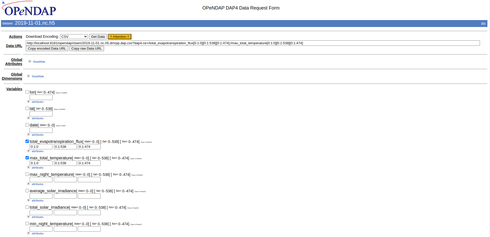

# Hyrax Configuration

Hyrax is a data server developed by OPeNDAP as a reference server for the Data Access Protocol, versions 2 and 4. This documentation shows how to integrate Hyrax into GAP Platform to read NetCDF files that are hosted in S3 Object Storage.


## Pre-requisites

- NetCDF Files hosted in a S3 bucket
- AWS_ACCESS_KEY_ID and AWS_SECRET_ACCESS_KEY
- AWS_ENDPOINT_URL (optional) if using a different storage server (e.g. minio)
- Local volume for mounting file cache
- Hyrax image: opendap/hyrax:1.17.0-122
- PyDAP package for reading URL from OpenDAP: pydap==3.4.1
- numpy==1.26.4 is needed for pydap that is not compatible with latest numpy version


## Important Notes

When NetCDF files are hosted in S3, we can leverage DMR++ files to access the NetCDF file using subsetting. This is useful to avoid caching the full NetCDF file before reading it. To learn more about DMR++, click [here](http://docs.opendap.org/index.php/DMR%2B%2B).

However, the downside is that we need to generate DMR++ files first and put them in the Hyrax data directory. Use below command to generate the DMR++ file.

```
get_dmrpp -b $(pwd) -o output.dmrpp -u http://minio:9000/tomorrownow/cbam/2019-11-06.nc.h5 s3://tomorrownow/cbam/2019-11-06.nc.h5
```

- http://minio:9000/tomorrownow/cbam/2019-11-06.nc.h5 is a URL to access the file. This URL will be included in the output.dmrpp file
- s3://tomorrownow/cbam/2019-11-06.nc.h5 is the location that get_dmrpp binary will try to find the NetCDF file
- get_dmrpp binary will use aws cli and it's recommended to upgrade to aws cli v2 to support endpoint-url in the AWS config file.
- Configure endpoint-url in ~/.aws/config if endpoint-url is not a default AWS URL (e.g. minio).

### CBAM Datasets

We need to rename the NetCDF Files from CBAM to make the Hyrax and get_dmrpp binary able to read the files. The Hyrax is using a regex to determine the Backend Module for reading and the CBAM files seems to be a HDF5 files.

```
mv 2019-11-01.nc 2019-11-01.nc.h5
```

### Salient Datasets

We encountered error when generating DMR++ file for Salient Data Sample file, so the only option is to copy the whole NetCDF file into Hyrax Data Directory. When checking the type of NetCDF using command `ncdump -k downscale_2024-03-13_rwanda.nc`, the type is `64-bit offset` which may not compatible with get_dmrpp binary. However, we do not need to rename the file with h5 like we do for CBAM datasets.


## Custom site.conf

Below is the custom configuration for Hyrax:

```
# allow minio to allowed host Hyrax for dev
AllowedHosts+=^http:\/\/minio\:9000\/.*$
Gateway.Whitelist+=http://minio:9000
# use parallel transfers
DMRPP.UseParallelTransfers = yes
# fix error on finding effective url during caching
Http.cache.effective.urls=false
# credentials manager
CredentialsManager.config=/etc/bes/credentials.conf

DAP.GlobalMetadataStore.path = /usr/share/mds
DAP.Use.Dmrpp = yes
```

## S3 Credentials

To allow Hyrax accessing S3, the credentials.conf must be used. We created a custom `entrypoint.sh` script that will write during the startup of the container.

```
#!/bin/bash

file="/etc/bes/credentials.conf"

if [ -f "$file" ] ; then
    rm "$file"
fi

touch "$file"
echo "tomorrownow = url:${AWS_ENDPOINT_URL}${S3_AWS_BUCKET_NAME}/" >> "$file"
echo "tomorrownow += id:${AWS_ACCESS_KEY_ID}" >> "$file"
echo "tomorrownow += key:${AWS_SECRET_ACCESS_KEY}" >> "$file"
echo "tomorrownow += region:us-east-1" >> "$file"
echo "tomorrownow += bucket:${AWS_ENDPOINT_URL}" >> "$file"

chmod 600 "$file"
chown bes:bes "$file"

# run original entrypoint
./entrypoint.sh
```

## Hyrax Service in docker compose files

docker-compose.yml
```
  hyrax:
    image: opendap/hyrax:1.17.0-122
    ports:
      - "8181:8080"
    environment:
      - AWS_ACCESS_KEY_ID=${AWS_ACCESS_KEY_ID:-minio_tomorrownow}
      - AWS_SECRET_ACCESS_KEY=${AWS_SECRET_ACCESS_KEY:-minio_tomorrownow}
      - AWS_ENDPOINT_URL=${AWS_ENDPOINT_URL}
      - S3_AWS_BUCKET_NAME=${S3_AWS_BUCKET_NAME:-tomorrownow}
    volumes:
      - hyrax-data:/usr/share/hyrax
    restart: always
```

docker-compose.override.yml
```
  hyrax:
    entrypoint: [ "/custom_entrypoint.sh" ]
    volumes:
      - ./volumes/hyrax_data:/usr/share/hyrax
      - ./hyrax/site.conf:/etc/bes/site.conf:ro
      - ./hyrax/entrypoint.sh:/custom_entrypoint.sh
    links:
      - django
      - worker
```

`/volumes/hyrax_data` is the volume for storing cache of dmrpp files or Salient data files. 

## Accessing Hyrax UI

Hyrax has a UI that can be accessed in http://localhost:8181/opendap/.


We can query using html UI and export the data into different format like csv.



**Note:** we can use slicing syntax to access the data: [start:step:end].


## Accessing using Python Script

### CBAM Dataset

```
from pydap.client import open_url, open_dods_url

CBAM_METADATA = {
    'lon': {
        'min': 26.9665,
        'inc': 0.036006329,
        'size': 475
    },
    'lat': {
        'min': -12.5969,
        'inc': 0.03574368,
        'size': 539
    }
}

def find_idx(value, base_min, inc):
    return round((value - base_min) / inc)

# Function to slice along multiple specified axes
def slice_along_axes(array, indices):
    slices = [slice(None)] * array.ndim  # Create a list of slices

    # Set the slices for the specified axes
    for axis, index in indices.items():
        slices[axis] = index

    return array[tuple(slices)]


search_lat = -3.25
search_lon = 30.4
idx_lat = find_idx(search_lat, CBAM_METADATA['lat']['min'], CBAM_METADATA['lat']['inc'])
idx_lon = find_idx(search_lon, CBAM_METADATA['lon']['min'], CBAM_METADATA['lon']['inc'])
dataset = open_url('http://hyrax:8080/opendap/cbam/2019-11-09.nc.h5.dmrpp')
mtt = dataset['max_total_temperature']
result = slice_along_axes(mtt['max_total_temperature'], {1: idx_lat, 2: idx_lon})
print(result)
```

### Salient Dataset

```
from pydap.client import open_url, open_dods_url

SALIENT_METADATA = {
    'lon': {
        'min': 28.875,
        'inc': 0.25,
        'size': 9
    },
    'lat': {
        'min': -2.875,
        'inc': 0.25,
        'size': 8
    }
}

def find_idx(value, base_min, inc):
    return round((value - base_min) / inc)

# Function to slice along multiple specified axes
def slice_along_axes(array, indices):
    slices = [slice(None)] * array.ndim  # Create a list of slices

    # Set the slices for the specified axes
    for axis, index in indices.items():
        slices[axis] = index

    return array[tuple(slices)]


search_lat = -2.215
search_lon = 29.125
idx_lat = find_idx(search_lat, SALIENT_METADATA['lat']['min'], CBAM_METADATA['lat']['inc'])
idx_lon = find_idx(search_lon, SALIENT_METADATA['lon']['min'], CBAM_METADATA['lon']['inc'])
dataset = open_url('http://hyrax:8080/opendap/salient/downscale_2024-03-13_rwanda.nc')
temp_clim = dataset.temp_clim
result = slice_along_axes(temp_clim['temp_clim'], {1: idx_lat, 2: idx_lon})
print(result)
```
